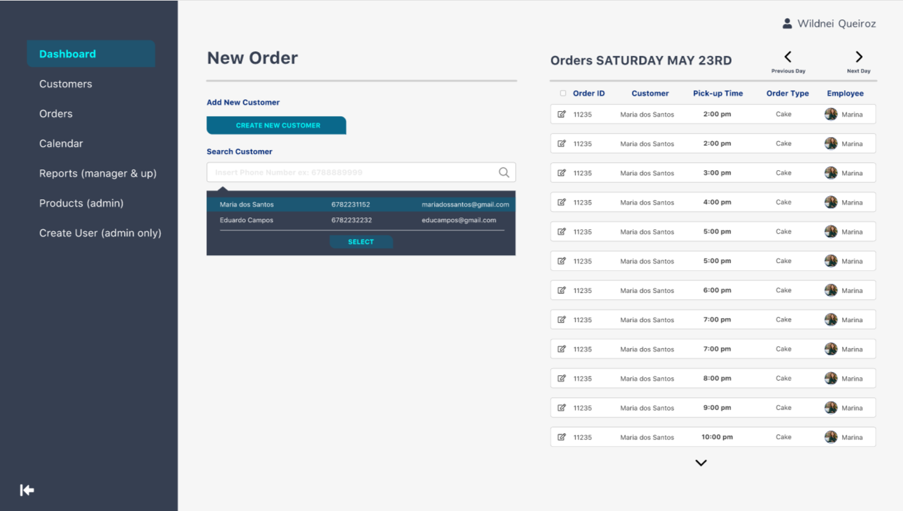
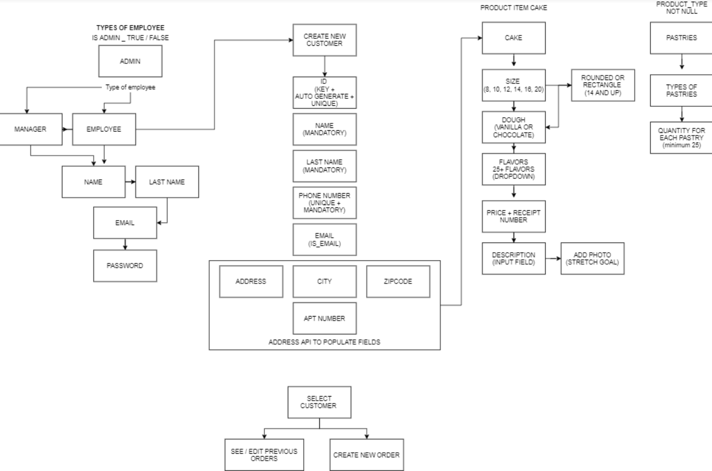

# Dapper Project

   
     

---
## Purpose

This application is an order request system for a bakery. For small businesses like bakeries and cafes and effective management system is extremely important but is often orverlooked and more traditional methods like paper reciepts are used to keep track of everything. Using this software, the staff will be able to:

* log into their rofiles creating a unique ID that tracks who enterd what order
* search the database of for a previous customer by their phone number in order to pull up their record or create a new customer
* create orders
* search through orders by date
---
## Mockup


---
## Code

This router.post function is the final snippet that takes in all inputs from the last two pages and links them to the order creation. 
```
router.post("/create_order_item", withAuth, async (req, res) => {
  try {
    const flavorData = await Flavor.findAll();
    const flavors = flavorData.map(flavor => flavor.get({ plain: true }));

    const sizeData = await Size.findAll();
    const sizes = sizeData.map(size => size.get({ plain: true }));

    const productTypeData = await ProductType.findAll();
    const productType = productTypeData.map(productType => productType.get({ plain: true }));
    const { customerId, pickUpDate, pickUpTime, customerFirstName, customerLastName, customerPhoneNumber} = req.body;
    
    res.render("reports", {
      logged_in: req.session.logged_in,
      flavors,
      sizes,
      productType,
      customerId,
      pickUpDate,
      pickUpTime,
      customerFirstName,
      customerLastName,
      customerPhoneNumber
    });
  } catch (err) {
    res.status(500).json(err);
  }
  
});
```
As the order item is the last table to be populated in the db, the router.get function is justifiably complex. Using the where:{ } and include [ ] operators you are able to render a reports page for that individual order item that populates using handlebars.

```
router.get("/create_order_item/:orderId", async (req, res) => {
  try {

    const flavorData = await Flavor.findAll();
    const flavors = flavorData.map((flavor) => flavor.get({ plain: true }));

    const sizeData = await Size.findAll();
    const sizes = sizeData.map((size) => size.get({ plain: true }));


    console.log("req.params.orderId: " + req.params.orderId);
    const dbOrderData = await Orders.findOne({
      where: {
        id: req.params.orderId,
      },
      include: [
        {
          model: Customer,
          attributes: ['first_name', 'last_name'],
        },
        {
          model: User,
          attributes: ['first_name', 'last_name'],
        },
      ],
    });
    console.log("After findOne");
    const order = dbOrderData.get({ plain: true });
  
    console.log(order);

    res.render("reports", {
      order,
      flavors,
      sizes,  
      logged_in: req.session.logged_in,
    });
  }catch (err) {
    res.status(500).json(err);
  }
});
```

---
## Site 
https://evening-falls-76240.herokuapp.com/
Credentials 
email: jack@email.com
password: pass1234
